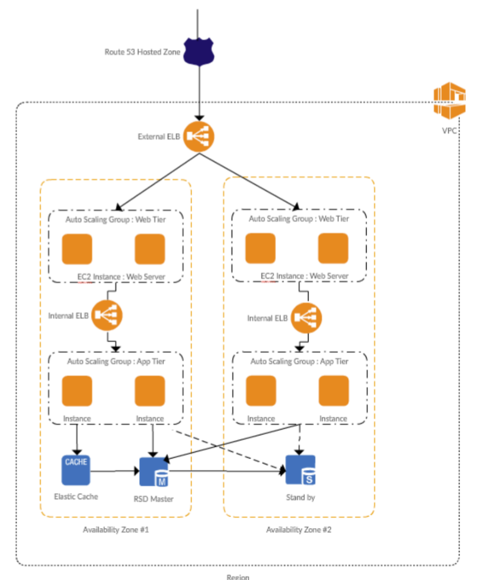

# Elastic Load Balancer

* Configure **Sticky Sessions** for Your Classic Load Balancer - enables the load balancer to bind a user's session to a specific instance. Requirements:
  * An HTTP/HTTPS load balancer
  * At least one healthy instance in each Availability Zone
* With** cross-zone load balancing**, each load balancer node for your Classic Load Balancer **distributes requests evenly** across the registered instances in all enabled Availability Zones. If cross-zone load balancing is disabled, each load balancer node distributes requests evenly across the registered instances in its Availability Zone only. 

* Elastic Load Balancing provides **access logs** that capture detailed information about requests sent to your load balancer.
* Configure Health Checks
  * Ping Protocol: TCP \(CLI/API default\), HTTP \(console default\), HTTPS, and SSL
  * Ping port range: 1 to 65535 \(default 80\)
* ELBs cost money – ensure to delete them when not using
* ELBs always have DNS name – no public IP Addresses. Trick question might induce you into believing IP4 address for ELB

### Internal ELB vs. Internet-facing ELB

You can assign instance from private subnet to ELB, in this case, ELB will automatically become internal ELB and AWS will assign scheme as "Internal". If your subnet is public then ELB will automatically become external ELB and AWS will assign scheme as "Internet-facing". You can add Internet Gateway to VPC and add IGW route in the subnet to make it available over the Internet, however, in this case, AWS will still show ELB scheme as internal but it will allow Internet traffic to the instance. \(You always need an IGW.\)

