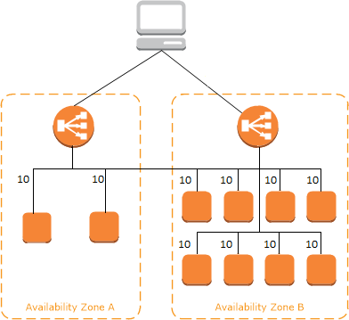
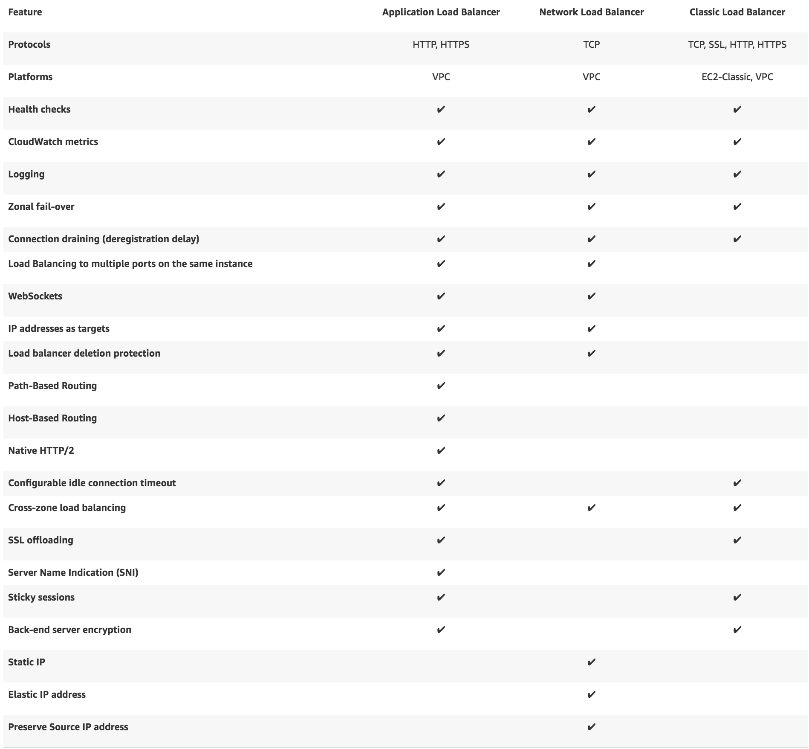

# Elastic Load Balancer

* Configure **Sticky Sessions** for Your Classic Load Balancer - enables the load balancer to bind a user's session to a specific instance. Requirements:
  * An HTTP/HTTPS load balancer
  * At least one healthy instance in each Availability Zone
* With** cross-zone load balancing**, each load balancer node for your Classic Load Balancer **distributes requests evenly** across the registered instances in all enabled Availability Zones. If cross-zone load balancing is disabled, each load balancer node distributes requests evenly across the registered instances in its Availability Zone only. 

* Elastic Load Balancing provides **access logs** that capture detailed information about requests sent to your load balancer.
* ELBs cost money – ensure to delete them when not using
* ELBs always have DNS name – no public IP Addresses. Trick question might induce you into believing IP4 address for ELB

