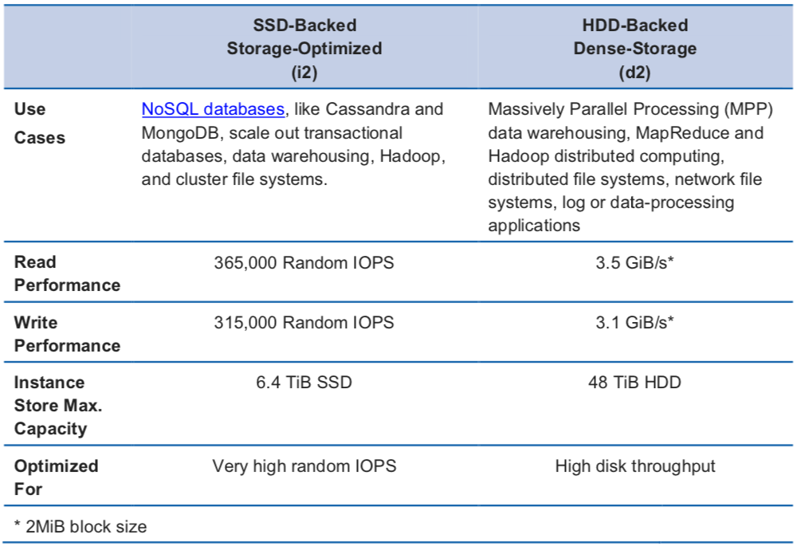

# Instance Store Volumes

* The virtual devices for instance store volumes are named as ephemeral
* If an instance reboots \(intentionally or unintentionally\), data in the instance store persists. However, data in the instance store is lost under the following circumstances:
  * The underlying disk drive fails
  * The instance stops
  * The instance terminates

